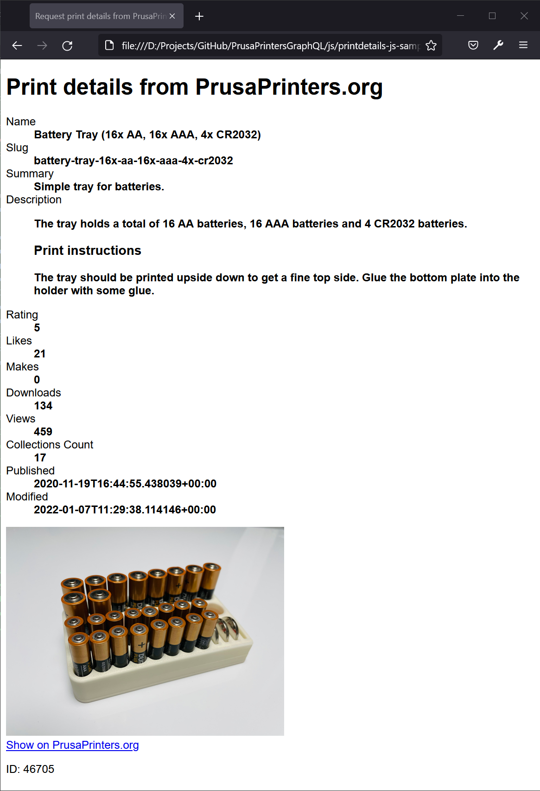

# PrintablesGraphQL

Simple implementation to get the print and user details from Printables.com

--------------------

## Supported data

* slug
* name
* user
	* id
	* publicUsername
	* avatarFilePath
	* slug
	* badgesProfileLevel
		* profileLevel
	* printsCount
* ratingAvg
* ratingCount
* description
* modified
* firstPublish
* datePublished
* summary
* shareCount
* likesCount
* makesCount
* downloadCount
* displayCount
* filesCount
* collectionsCount
* commentCount
* images
	* filePath
* thingiverseLink
* license
	* id
	* disallowRemixing

## JS Sample

